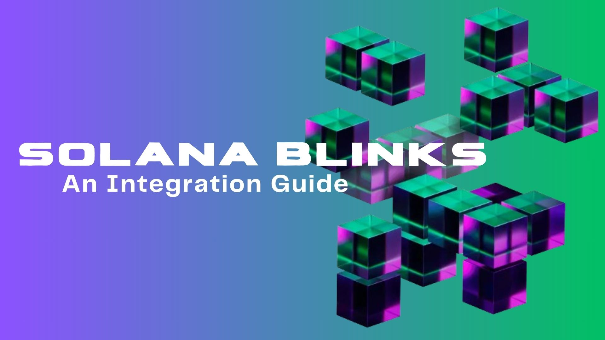
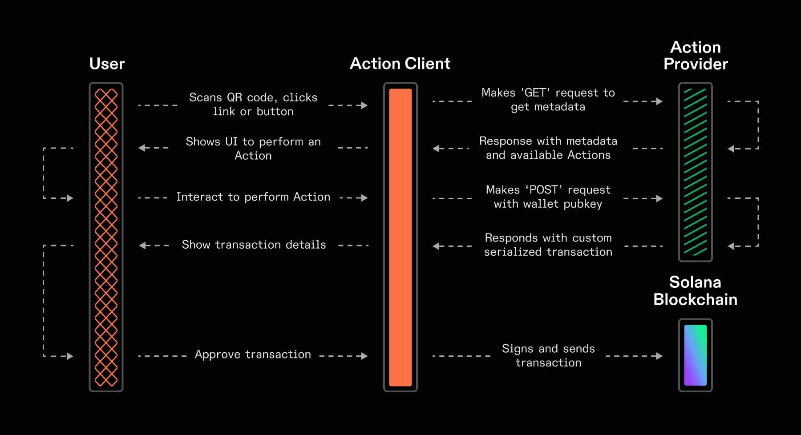

# Connecting Solana to the Entire Internet: Getting Started with Solana Blinks & Actions 👨🏾‍💻

## Table of Contents

- [Intro](#intro)
- [What are Solana Actions and Blinks?](#what-are-solana-actions-and-blinks)
- [Difference between Actions and blinks?](#difference-between-actions-and-blinks)
- [Solana Actions and Blinks Use Cases](#solana-actions-and-blinks-use-cases)
- [How Do Actions and Blinks Works?](#how-do-actions-and-blinks-works)
- [Developers’ Integration Guide](#developers-integration-guide)
- [Prerequisites](#prerequisites)

## Intro

At exactly 2:05 PM · Jun 25, 2024, the team at [Dialect](https://x.com/saydialect) announced the launching of Solana’s innovative Blinks, short for Blockchain Links: A powerful way of bringing crypto to the people and connecting Solana to the entire internet.

You can buy, sell, swap, vote, or engage with token-gated experiences without leaving your Twitter/X feed by installing a browser wallet. This guide will help developers go from zero-production with Blinks in a Blink 👀!

Blinks simplifies the process of online crypto transactions by reducing the long process. Rather than being redirected couple of times, you can complete it in one go. However, it’s important to remember that a Solana wallet(browsers-based) such as Phantom, Solflare and Backpack is still required to use Blinks, all you have to do, is to turn on Experimental features.

Using Solana Actions, you can turn any transaction into a blockchain link (Blinks) that can be shared anywhere on the internet — no third party application required. Request a payment in a text message. Vote on governance in a chatroom. Buy an NFT on social media. It’s all possible. Blockchain links (Blinks) are interfaces and just one way to interact with Solana Actions, you could build the next way, Solana Actions are the APIs to deliver transactions on many surfaces.

## What are Solana Actions and Blinks?

Solana Actions are standard APIs that return transactions on the Solana blockchain to be previewed, signed, and sent across various contexts, including QR codes, buttons + widgets in mobile and desktop applications, and websites across the internet. Actions make it simple for developers to integrate the things you can do throughout the Solana ecosystem right into your environment, allowing users to make blockchain transactions without switching to another app or website.

Blockchain links – or blinks – turn any Solana Action into a shareable, metadata-rich link. Blinks allow Action-sensitive clients (browser extension wallets, bots,etc.) to display additional capabilities for the user. In a web browser, it might show a preview of the transaction in a wallet without going to a decentralized app;In a chat app like Discord, it could turn into buttons you can interact with. Blinks make it possible to do blockchain transactions from almost anywhere you can share a link.

## Difference between Actions and blinks?

Actions are APIs that allow complex logic (both on and off-chain) to be used to construct transaction messages that are previewed, signed, and sent by the client. Native buttons, QR codes, or URLs (blinks) can initiate an Action.

Blinks are one way to interact with an Action. Blinks allow users to execute blockchain transactions directly from URLs, making decentralized applications accessible from any platform or device.

## Solana Actions and Blinks Use Cases

Currently, Blinks are experimentally integrated with X, enabling real-time blockchain transaction processing. They have found utility in payments, smart contract signing, voting, donations, and token swaps on [Dialect](https://dial.to/).

Some Use-cases of Solana Actions might include:

Staking SOL to help secure the Solana network, including liquid staking tokens. 
Allowing customers to pay at a retail store using a QR code scan. 
Token-gated minting experiences. 
Enabling e-commerce websites to accept cryptocurrency payments directly from product pages. 
Integrating blockchain functionality into gaming platforms for in-game asset purchases and trades. 

Some Use-cases of Solana Blinks might include:

Tipping content creators on social media without the need for complex wallet setups, 
Minting custom NFTs or participating in governance votes directly from URLs. 
Letting users vote on community policies via links in newsletters. 

## How Do Actions and Blinks Works?

### Actions:

**Purpose**:

- Allows applications to send signable transactions directly to users
- Uses standard APIs accessible via public URLs

**How it works**:

- Two main types of requests: GET and POST
- Both interact with an Action's URL endpoint

1. **GET Request**:
   - Retrieves metadata about the Action
   - Provides:
   - Human-readable information about available actions
   - Optional list of related actions

2. **POST Request**:
   - Returns a signable transaction or message
   - Process:
   - Client receives the transaction/message
   - Client prompts user's wallet to sign
   - Transaction is then executed on the blockchain or an off-chain service

Interacting with Solana Actions is similar to using a typical REST API:

**Initial GET Request**

- Client sends a GET request to the Action URL
- Purpose: Fetch metadata about available Actions

**Metadata Response**

- Endpoint returns:
- Application metadata (title, icon, etc.)
- List of available actions

**User Interface**

- Client (e.g., mobile wallet, chat bot, website) displays UI based on received metadata
- Shows options for user to perform actions

**User Action**

- User selects an action (e.g., clicks a button)

**POST Request**

- Client sends a POST request to the endpoint
- Purpose: Get the transaction for user to sign

> **Info**
>
> You can think of Actions as a API endpoint that will return metadata and something
> for a user to sign (either a transaction or a authentication message) with their blockchain wallet.

**Transaction Signing and Submission**

- Wallet helps user sign the transaction
- Signed transaction is sent to the blockchain for confirmation

**Transaction Lifecycle Management**

- Client handles submission of transactions to the blockchain
- Manages the state lifecycle of transactions

**Action Invalidation**

- Actions support invalidation before execution
- GET and POST requests may return metadata about action availability
- Example: "disabled" field indicates if an action can be taken

**Error Handling**

- Actions can return error messages and disable options when not applicable
- Example: A closed voting window might return "This proposal is no longer up for a vote" and disable voting buttons

### Blinks:

Blinks (blockchain links) are client applications that reflect Action APIs and construct user interfaces around interacting with and executing Actions.

Client applications that support blinks simply detect Action-compatible URLs, parse them, and allow users to interact with them in standardized user interfaces.

> **INFO**
>
> Any client application that fully introspects an Actions API to build
> a complete interface for it is a blink. Therefore, not all clients that
> consume Actions APIs are blinks.

## Developers’ Integration Guide

Developers can create actions as separate APIs that comply with the Solana Actions Specification, and then may link them to their existing site URLs using an actions.json file.

Blinks are fully-qualified URLs. An actions.json file must be published at the root of the domain (e.g., payclip.com/actions.json) in order to self-register as a blink.

As at now , all four extensions (Phantom, Backpack, Dialect, Solflare) will only unfurl registered (“trusted”) Actions URLs on [Twitter/X](http://x.com/). To enable this, developers must register their Actions in the [Dialect Actions Registry](http://dial.to/register).

Developers can test the entire end-to-end flow, including what the blink will look like, on [dial.to](http://dial.to/) by inputting their Actions URL.

Additionally, there are a host of libraries and SDKs for developers who wish to build clients that support blinks, or wallet chrome extensions that add blinks to existing sites like [Twitter/X](http://x.com/). These libraries make it possible to build applications that render and style blinks with little work.

**Now, We are going to Build a Blink to Transfer $SOL.**

## Prerequisites

Before you get our hands dirty, make sure you have the following:

- Basic understanding of JavaScript/TypeScript and Solana.
- A Solana wallet installed in your browser (e.g., Solflare).
- Node.js installed on your machine.

Now, Let's go!

**Step 1: Setting Up Your Environment:**

