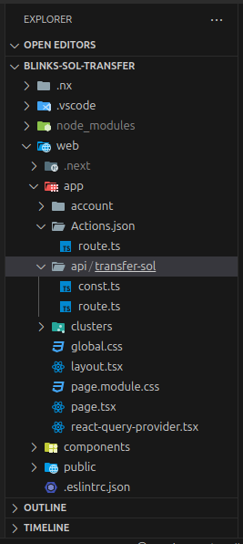

# Connecting Solana to the Entire Internet: Getting Started with Solana Blinks & Actions 👨🏾‍💻


## Table of Contents

- [Intro](#intro)
- [What are Solana Actions and Blinks?](#what-are-solana-actions-and-blinks)
- [Difference between Actions and blinks?](#difference-between-actions-and-blinks)
- [Solana Actions and Blinks Use Cases](#solana-actions-and-blinks-use-cases)
- [How Do Actions and Blinks Works?](#how-do-actions-and-blinks-works)
- [How to Build Blinks](#how-to-build-blinks)
- [Prerequisites](#prerequisites)
- [Conclusion](#conclusion)
- [Resources](#resources)

## Intro

At exactly 2:05 PM · Jun 25, 2024, the team at [Dialect](https://x.com/saydialect) announced the launching of Solana’s innovative Blinks, short for Blockchain Links: A powerful way of bringing crypto to the people and connecting Solana to the entire internet.

You can buy, sell, swap, vote, or engage with token-gated experiences without leaving your Twitter/X feed by installing a browser wallet. This guide will help developers go from zero-production with Blinks in a Blink 👀!

Blinks simplifies the process of online crypto transactions by reducing the long process. Rather than being redirected couple of times, you can complete it in one go. However, it’s important to remember that a Solana wallet(browsers-based) such as Phantom, Solflare and Backpack is still required to use Blinks, all you have to do, is to turn on Experimental features.

Using Solana Actions, you can turn any transaction into a blockchain link (Blinks) that can be shared anywhere on the internet — no third party application required. Request a payment in a text message. Vote on governance in a chatroom. Buy an NFT on social media. It’s all possible. Blockchain links (Blinks) are interfaces and just one way to interact with Solana Actions, you could build the next way, Solana Actions are the APIs to deliver transactions on many surfaces.

## What are Solana Actions and Blinks?

Solana Actions are standard APIs that return transactions on the Solana blockchain to be previewed, signed, and sent across various contexts, including QR codes, buttons + widgets in mobile and desktop applications, and websites across the internet. Actions make it simple for developers to integrate the things you can do throughout the Solana ecosystem right into your environment, allowing users to make blockchain transactions without switching to another app or website.

Blockchain links – or blinks – turn any Solana Action into a shareable, metadata-rich link. Blinks allow Action-sensitive clients (browser extension wallets, bots,etc.) to display additional capabilities for the user. In a web browser, it might show a preview of the transaction in a wallet without going to a decentralized app;In a chat app like Discord, it could turn into buttons you can interact with. Blinks make it possible to do blockchain transactions from almost anywhere you can share a link.

## Difference between Actions and blinks?

Actions are APIs that allow complex logic (both on and off-chain) to be used to construct transaction messages that are previewed, signed, and sent by the client. Native buttons, QR codes, or URLs (blinks) can initiate an Action.

Blinks are one way to interact with an Action. Blinks allow users to execute blockchain transactions directly from URLs, making decentralized applications accessible from any platform or device.

## Solana Actions and Blinks Use Cases

Currently, Blinks are experimentally integrated with [Twitter/X](http://x.com/), enabling real-time blockchain transaction processing. They have found utility in payments, smart contract signing, voting, donations, and token swaps on [Dialect](https://dial.to/).

> Traditional onchain transactions have been locked away in apps or complex interfaces, 
> making it significantly harder for people to use crypto products.
> With Solana Actions and blockchain links, or blinks, 
> transactions can open up to anywhere on the internet — no dApp required.

Some Use-cases of Solana Actions might include:

Staking SOL to help secure the Solana network, including liquid staking tokens.<br>
Allowing customers to pay at a retail store using a QR code scan.<br>
Token-gated minting experiences.<br>
Enabling e-commerce websites to accept cryptocurrency payments directly from product pages.<br>
Integrating blockchain functionality into gaming platforms for in-game asset purchases and trades.<br>

Some Use-cases of Solana Blinks might include:

Tipping content creators on social media without the need for complex wallet setups,<br>
Minting custom NFTs or participating in governance votes directly from URLs.<br>
Letting users vote on community policies via links in newsletters.<br>

## How Do Actions and Blinks Works?

### Actions

**Purpose**:

- Allows applications to send signable transactions directly to users
- Uses standard APIs accessible via public URLs

**How it works**:

- Two main types of requests: GET and POST
- Both interact with an Action's URL endpoint

1. **GET Request**:
   - Retrieves metadata about the Action
   - Provides:
   - Human-readable information about available actions
   - Optional list of related actions

2. **POST Request**:
   - Returns a signable transaction or message
   - Process:
   - Client receives the transaction/message
   - Client prompts user's wallet to sign
   - Transaction is then executed on the blockchain or an off-chain service

Interacting with Solana Actions is similar to using a typical REST API:

**Initial GET Request**

- Client sends a GET request to the Action URL
- Purpose: Fetch metadata about available Actions

**Metadata Response**

- Endpoint returns:
- Application metadata (title, icon, etc.)
- List of available actions

**User Interface**

- Client (e.g., mobile wallet, chat bot, website) displays UI based on received metadata
- Shows options for user to perform actions

**User Action**

- User selects an action (e.g., clicks a button)

**POST Request**

- Client sends a POST request to the endpoint
- Purpose: Get the transaction for user to sign


> **Info**
>
> You can think of Actions as a API endpoint that will return metadata and something
> for a user to sign (either a transaction or a authentication message) with their blockchain wallet.

**Transaction Signing and Submission**

- Wallet helps user sign the transaction
- Signed transaction is sent to the blockchain for confirmation

**Transaction Lifecycle Management**

- Client handles submission of transactions to the blockchain
- Manages the state lifecycle of transactions

**Action Invalidation**

- Actions support invalidation before execution
- GET and POST requests may return metadata about action availability
- Example: "disabled" field indicates if an action can be taken

**Error Handling**

- Actions can return error messages and disable options when not applicable
- Example: A closed voting window might return "This proposal is no longer up for a vote" and disable voting buttons

### Blinks

Blinks (blockchain links) are client applications that reflect Action APIs and construct user interfaces around interacting with and executing Actions.

Client applications that support blinks simply detect Action-compatible URLs, parse them, and allow users to interact with them in standardized user interfaces.

> **INFO**
>
> Any client application that fully introspects an Actions API to build
> a complete interface for it is a blink. Therefore, not all clients that
> consume Actions APIs are blinks.

## How to Build Blinks

Developers can create actions as separate APIs that comply with the Solana Actions Specification, and then may link them to their existing site URLs using an actions.json file.

Blinks are fully-qualified URLs. An actions.json file must be published at the root of the domain (e.g., payclip.com/actions.json) in order to self-register as a blink.

As at now , all four extensions (Phantom, Backpack, Dialect, Solflare) will only unfurl registered (“trusted”) Actions URLs on [Twitter/X](http://x.com/). To enable this, developers must register their Actions in the [Dialect Actions Registry](http://dial.to/register).

Developers can test the entire end-to-end flow, including what the blink will look like, on [dial.to](http://dial.to/) by inputting their Actions URL.

Additionally, there are a host of libraries and SDKs for developers who wish to build clients that support blinks, or wallet chrome extensions that add blinks to existing sites like [Twitter/X](http://x.com/). These libraries make it possible to build applications that render and style blinks with little work.

**Now, We are going to Build a Blink to Transfer $SOL.**

## Prerequisites

Before you get our hands dirty, make sure you have the following:

- Basic understanding of JavaScript/TypeScript and Solana.
- A Solana wallet installed in your browser (e.g., Phantom, Solflare).
- Node.js installed on your machine.

Now, Let's go!

**Step 1: Setting Up Your Environment:**<br>
First, ensure you have Node.js and npm installed. You can download them from [here](https://nodejs.org/).

So we are going to be doing this two ways, you could use which ever one works for you:

**Create Solana dapp** <br>
**Create a Next.js app**

> **Reasons**
>
> If you are building a full Solana dApp, with frameworks like Anchor, you may want to use the Create Solana dapp,
> because it comes pre-installed, when you click YES to the option while installing the Create Solana dapp,
> anything other than that,you can go with the regular Create a Next.js app.

**Create Solana dapp:**

```test
npx create-solana-dapp
```

Name your project and change the directory. Mine;

```test
cd blinks-sol-transfer
npm run dev
```

1. **Create Directories:**

Under `web/app`, create two folders:

- `api/transfer-sol` (you can choose a different name if needed)
- `Actions.json`

2. **Create `route.ts` Files:**

- Inside the `api/transfer-sol` folder, create a file named `route.ts` and `const.ts`.
- Inside the `Actions.json` folder, create another file named `route.ts`.

Your directory structure should look like this:



**Create a Next.js app:**

```test
npx create-next-app@latest
```

Name your project and change the directory. Mine;

```test
cd blinks-sol-transfer
npm run dev
```

1. **Create Directories:**

Under `src/app`, create two folders:

- `api/transfer-sol` (you can choose a different name if needed)
- `Actions.json`

2. **Create `route.ts` Files:**

- Inside the `api/transfer-sol` folder, create a file named `route.ts` and `const.ts`.
- Inside the `Actions.json` folder, create another file named `route.ts`.

Your directory structure should look like this:


**Step 2: Installing the Solana Action SDK:**<br> 
It is a dependency for the Solana blockchain, and it powers Blinks.

```test
npm install @solana/actions
```

**Step 3: Creating Your First Blink:**
Here is a basic example of how to create a Blink.

Now, We will implement the API routes to handle the transfer of $SOL.

To set up the API routes for handling $SOL transfer, follow these steps:

1. Go to the `src/app/api/transfer-sol` or `web/app/api/transfer-sol` folder.

2. Open the `route.ts` file in this folder.

3. Insert the following code into the `route.ts` file:

```typescript

import {
   ActionPostResponse,
   ACTIONS_CORS_HEADERS,
   createPostResponse,
   ActionGetResponse,
   ActionPostRequest,
 } from "@solana/actions";
 import {
   clusterApiUrl,
   Connection,
   LAMPORTS_PER_SOL,
   PublicKey,
   SystemProgram,
   Transaction,
 } from "@solana/web3.js";
 import { DEFAULT_SOL_ADDRESS, DEFAULT_SOL_AMOUNT } from "./const";
 
 export const GET = async (req: Request) => {
   try {
     const requestUrl = new URL(req.url);
     const { toPubkey } = validatedQueryParams(requestUrl);
 
     const baseHref = new URL(
       `/api/actions/transfer-sol?to=${toPubkey.toBase58()}`,
       requestUrl.origin,
     ).toString();
 
     const payload: ActionGetResponse = {
       title: "Transfer Native SOL",
       icon: new URL("< image >", requestUrl.origin).toString(),
       description: "Transfer SOL to author",
       label: "Transfer", // this value may be ignored since `links.actions` exists
       links: {
         actions: [
           {
              label: "Send 1 SOL", // button text
              href: `${baseHref}&amount=${"1"}`,
              type: "transaction"
           },
           {
              label: "Send 5 SOL", // button text
              href: `${baseHref}&amount=${"5"}`,
              type: "transaction"
           },
           {
              label: "Send 10 SOL", // button text
              href: `${baseHref}&amount=${"10"}`,
              type: "transaction"
           },
           {
              label: "Send SOL", // button text
              href: `${baseHref}&amount={amount}`, // this href will have a text input
              parameters: [
                 {
                    name: "amount", // parameter name in the `href` above
                    label: "Enter the amount of SOL to send", // placeholder of the text input
                    required: true,
                 },
              ],
              type: "transaction"
           },
         ],
       },
     };
 
     return Response.json(payload, {
       headers: ACTIONS_CORS_HEADERS,
     });
   } catch (err) {
     console.log(err);
     let message = "An unknown error occurred";
     if (typeof err == "string") message = err;
     return new Response(message, {
       status: 400,
       headers: ACTIONS_CORS_HEADERS,
     });
   }
 };
 
 // PLEASE DO NOT FORGET TO INCLUDE THE `OPTIONS` HTTP METHOD
 // THIS WILL ENSURE CORS WORKS FOR BLINKS, IF YOU DON'T INCLUDE IT, YOUR BLINKS WILL NEVER WORK!!!
 export const OPTIONS = GET;
 
 export const POST = async (req: Request) => {
   try {
     const requestUrl = new URL(req.url);
     const { amount, toPubkey } = validatedQueryParams(requestUrl);
 
     const body: ActionPostRequest = await req.json();
 
     // Validation
     let account: PublicKey;
     try {
       account = new PublicKey(body.account);
     } catch (err) {
       return new Response('Invalid "account" provided', {
         status: 400,
         headers: ACTIONS_CORS_HEADERS,
       });
     }
 
     const connection = new Connection(
       process.env.SOLANA_RPC! || clusterApiUrl("devnet"), // Remember to change when you deploy on main-net
     );
 
     // ensure the receiving account will be rent exempt
     const minimumBalance = await connection.getMinimumBalanceForRentExemption(
       0, // note: simple accounts that just store native SOL have `0` bytes of data
     );
     if (amount * LAMPORTS_PER_SOL < minimumBalance) {
       throw `account may not be rent exempt: ${toPubkey.toBase58()}`;
     }
 
     // This creates an instruction to transfer native SOL from one wallet to another.
     const transferSolInstruction = SystemProgram.transfer({
       fromPubkey: account,
       toPubkey: toPubkey,
       lamports: amount * LAMPORTS_PER_SOL,
     });
 
     // This gets the latest blockhash amd block height
     const { blockhash, lastValidBlockHeight } =
       await connection.getLatestBlockhash();
 
     // This  creates a legacy transaction
     const transaction = new Transaction({
       feePayer: account,
       blockhash,
       lastValidBlockHeight,
     }).add(transferSolInstruction);
 
     const payload: ActionPostResponse = await createPostResponse({
      fields: {
        transaction,
        message: `Send ${amount} SOL to ${toPubkey.toBase58()}`,
        type: 'transaction', // Add the required 'type' property
      },
      // note: no additional signers are needed
      // signers: [],
    });
 
     return Response.json(payload, {
       headers: ACTIONS_CORS_HEADERS,
     });
   } catch (err) {
     console.log(err);
     let message = "An unknown error occurred";
     if (typeof err == "string") message = err;
     return new Response(message, {
       status: 400,
       headers: ACTIONS_CORS_HEADERS,
     });
   }
 };
 
 function validatedQueryParams(requestUrl: URL) {
   let toPubkey: PublicKey = DEFAULT_SOL_ADDRESS;
   let amount: number = DEFAULT_SOL_AMOUNT;
 
   try {
     if (requestUrl.searchParams.get("to")) {
       toPubkey = new PublicKey(requestUrl.searchParams.get("to")!);
     }
   } catch (err) {
     throw "Invalid input query parameter: to";
   }
 
   try {
     if (requestUrl.searchParams.get("amount")) {
       amount = parseFloat(requestUrl.searchParams.get("amount")!);
     }
 
     if (amount <= 0) throw "amount is too small";
   } catch (err) {
     throw "Invalid input query parameter: amount";
   }
 
   return {
     amount,
     toPubkey,
   };
 }

```

Similarly,

1. Open the `const.ts` file in this folder.

2. Insert the following code into the `const.ts` file:

```typescript

import { PublicKey } from "@solana/web3.js";

export const DEFAULT_SOL_ADDRESS: PublicKey = new PublicKey(
  "<your public key>", //Replace it with your Solana wallet address
);

export const DEFAULT_SOL_AMOUNT: number = 1.0;

```

**Step 4: Set the Actions:**

To set up the Actions JSON, follow these steps:

1. Go to the `src/app/Actions.json` or `web/app/Actions.json` folder.

2. Open the `route.ts` file in this folder.

3. Insert the following code into the `route.ts` file:

```typescript

import { ACTIONS_CORS_HEADERS, ActionsJson } from "@solana/actions";

export const GET = async () => {
  const payload: ActionsJson = {
    rules: [
      // map all root level routes to an action
      {
        pathPattern: "/",
        apiPath: "/api/donate/",
      },
    ],
  };

  return Response.json(payload, {
    headers: ACTIONS_CORS_HEADERS,
  });
};

export const OPTIONS = GET;

```

**Step 5: Verify your API:**

We are done, writing codes,

Now let's verify the GET API response by sending a request to the API using the Thunder client extension in VS Code.


You can do it using [Postman](https://www.postman.com/) also.


> Please: Use http instead of https, when you enter the URL

**Step 6: Check POST API Response:**

Verify the POST API response by sending a request with the sender’s account details included in the request body.


## Conclusion

This guide provided an overview of creating Blinks on Solana, including basic setup, creating a simple Blink, and handling various use cases. By following these steps, you should be able to create and deploy your own Blinks, enabling interactive blockchain experiences on [Twitter/X](http://x.com/).

## Resources

- [Dialect](https://x.com/saydialect)
- [Dialect Protocol Docs](https://www.dialect.to/)
- [Dialect Github Repository](https://github.com/dialectlabs/blinks)
- [SuperteamNG RADAR Workshop(Blinks Integration by franciscodex)](https://drive.google.com/file/d/1ILhjpO4sp9KOTLm7t6FkH7nL5sHr4h6h/view?usp=sharing)
- [Sample codes for creating Solana Actions](https://solana-actions.vercel.app/)
- [Official Solana Actions and Blinks docs](https://solana.com/docs/advanced/actions)
- [Solana Actions Github](https://github.com/solana-developers/solana-actions)
- [Solana Actions Youtube Tutorials](https://www.youtube.com/watch?v=kCht01Ycif0)
- [What are BLINKs?\[Youtube Tutorial\]](https://www.youtube.com/watch?v=F_5AtCyw_9g&t=688s)
- [Create your own BLINK \[Solana Youtube Tutorial\]](https://www.youtube.com/watch?v=dLpu6vYsTaI&t=1858s)